# shapes

Provides the modules to procedurally generate 3D shape models, which can be used when programming 3D games by panda3D.
In addition to generating basic 3D shapes, you can create many variations by changing parameters.
For example, you can make them hollow inside or cut them like a pie.
Currently, the following 3D shapes can be created, but I plan to add more in the future. 
A model editor [3DModelEditor](https://github.com/taKana671/3DModelEditor) allows you to create a 3D model while seeing how the shape changes as you change the parameters.  
And this repositroy is also a submodule for
* https://github.com/taKana671/VoronoiCity
* https://github.com/taKana671/DeliveryCart


# Icosphere and Cubesphere


Initially, the UV calculations for the icosphere and cubesphere did not work properly, resulting in ziggzagging distortion effect. 
By recalculating the UVs using the following site as a reference, I was able to prevent that effect.

- https://observablehq.com/@mourner/uv-mapping-an-icosphere


# Requirements
* Panda3D 1.10.16
* numpy 2.2.6

# Environment
* Python 3.13
* Windows11
* Ubuntu 24.04.3

# Usage of modules

* There are 15 classes, including Cylinder, Sphere, Box, Torus, Cone, Plane, Capsule, Icosphere, Cubesphere and so on, but they all have the same usage.
* Instantiate and call create method.
* When instantiating, change parameters as necessary.
* Returnd model is a NodePath of Panda3D.
```
from shapes import Box

box_maker = Box()
model = box_maker.create() 
```

# Class Diagram

```mermaid
classDiagram
  class _ProceduralGeometry_{
    <<abstract>>
    +*get_geom_node*()
    +create()
    +modeling()
    +create_format()
    +create_geom_node()
    +tranform_vertices()
    +add()
    +merge_geom()
   }

  namespace cylinder {
    class BasicCylinder{
      +\_\_init\_\_()
      +create_bottom_cap_triangles()
      +create_bottom_cap_quads()
      +create_mantle_quads()
      +create_top_cap_triangles()
      +create_top_cap_quads()
      +create_cylinder()
      +create_cap_triangles()
      +create_cap_quad_vertices()
      +create_mantle_quad_vertices()    
      +create_slice_cap_quad_vertices()
      +create_slice_cap_quads()
      +define_variables()
    }

    class Cylinder{
      +get_geom_node()
    }
  }

  namespace capsule {
    class Capsule{
      +\_\_init\_\_()
      +create_hemisphere()
      +create_bottom()
      +create_mantle()
      +create_top()
      +create_slice_caps()
      +get_geom_node()
    }

    class CapsuleHemisphere{
      +\_\_init\_\_()
      +get_cap_edge_vertices()
      +create_cap_edge_vertices()
      +create_bottom()
      +create_top()
      +create_mantle_quads()
      +get_hollow_cap_inner_vertices()
      +get_closed_cap_inner_vertices()
      +create_slice_cap()
    }
  }

  namespace box {
    class BasicBox{
      +\_\_init\_\_()
      +define_vertex_order()
      +create_side()
      +create_thick_side()
      +get_plane_details()
      +create_sides()
      +define_inner_details()
      +define_variables()
      +calc_inner_box_center()
    }

    class Box{
      +get_geom_node()
    }
  }

  namespace basic_roundedbox {
    class RoundedBox{
      +create_sides()
      +create_vertical_edge_cylinder()
      +create_horizontal_edge_cylinder()
      +create_corner_sphere()
    }

    class VerticalRoundedEdge{
      +\_\_init\_\_()
      +create_cap_triangles()
      +create_cap_quad_vertices()
      +create_mantle_quad_vertices()
    }

    class HorizontalRoundedEdge{
      +\_\_init\_\_()
      +get_cap_normal()
      +create_cap_triangles()
      +create_cap_quad_vertices()
      +create_mantle_quad_vertices()
      +get_slice_cap_angle()
      +create_slice_cap_quad_vertices()
      +define_variables()
    }

    class QuarteredHemisphereCorner{
      +\_\_init\_\_()
      +create_quartered_hemisphere()
      +get_cap_edge_vertices()
      +create_cap_edge_vertices()
      +create_mantle_quads()
    }
  }
  
  namespace roundedbox {
    class RoundedCornerBox {
      +\_\_init\_\_()
      +create_side_rect()
      +create_rounded_corners()
      +create_rect_corners()
      +create_rect_sides()
      +create_corners()
      +define_variables()
      +get_geom_node()
    }

    class RoundedEdgeBox {
      +\_\_init\_\_()
      +create_rect()
      +create_rounded_corner()
      +create_horizontal_rounded_edge()
      +create_vertical_rounded_edge()
      +create_rect_side()
      +create_rect_edges()
      +create_bottom()
      +create_middle()
      +create_top()
      +define_variables()
      +get_geom_node()
    }

    class CapsulePrism {
      +create_rounded_corners()
      +create_corners()
      +define_variables()
      +get_geom_node()
    }
  }

  namespace sphere {
    class BasicSphere{
      +\_\_init\_\_()
      +get_cap_triangle_vertices()
      +get_cap_quad_vertices()
      +get_cap_edge_vertices()
      +create_cap_edge_vertices()
      +create_cap_pole()
      +create_bottom_cap_triangles()
      +create_bottom_cap_quads()
      +create_bottom_edge_quads()
      +create_bottom_pole_triangles()
      +define_bottom_cap()
      +create_bottom()
      +create_top_edge_quads()
      +create_top_pole_triangles()
      +create_top_cap_triangles()
      +create_top_cap_quads()
      +define_top_cap()
      +create_top()
      +create_mantle_quads()
      +get_thickness_cap_vertices()
      +get_cap_vertices()
      +create_slice_cap()
      +define_variables()
      +get_geom_node()
    }

    class Sphere{
      +get_geom_node()
    }

    class Ellipsoid {
      +\_\_init\_\_()
      +get_cap_axis()
      +create_cap_edge_vertices()
      +get_cap_quad_vertices()
      +get_cap_triangle_vertices()
      +get_cap_edge_vertices()
      +create_bottom()
      +create_top()
      +create_mantle_quads()
      +create_slice_cap()
      +get_thickness_cap_vertices()
      +get_cap_vertices()
      +define_inner_details()
      +define_variables()
      +get_geom_node()
    }
  }

  class Cone {
    +\_\_init\_\_()
    +create_bottom_cap_triangles()
    +create_bottom_cap_quads()
    +create_mantle_quads()
    +create_top_cap_triangles()
    +create_top_cap_quads()
    +create_slice_cap()
    +define_variables()
    +get_geom_node()
  }

  class Torus {
    +\_\_init\_\_()
    +create_mantle()
    +create_ring_cap()
    +create_section_cap()
    +get_geom_node()
  }

  class RightTriangularPrism {
    +\_\_init\_\_()
    +create_cap_triangles()
    +create_cap_quad_vertices()
    +create_bottom_cap_triangles()
    +create_bottom_cap_quads()
    +create_mantle_quads()
    +create_top_cap_triangles()
    +create_top_cap_quads()
    +create_slice_cap_quads()
    +calc_radius()
    +define_variables()
    +get_geom_node()
  }

  class Plane {
    +\_\_init\_\_()
    +get_geom_node()
  }

  class EllipticalPrism {
    +\_\_init\_\_()
    +create_cap_triangles()
    +create_cap_quad_vertices()
    +create_bottom_cap_triangles()
    +create_bottom_cap_quads()
    +create_mantle_quads()
    +create_top_cap_triangles()
    +create_top_cap_quads()
    +create_slice_cap_quads()
    +define_variables()
    +get_geom_node()
  }

  namespace polyhedron {
    class TriangleGenerator {
      <<mixin>>
      +calc_midpoints()
      +subdivide()
    }
    
    class Polyhedron {
      <<abstract>>
      +*generate_triangles*()
      +*create_polyhedron*()
      +\_\_init\_\_()
      +generate_divided_tri()
      +create_polyhedron_geom_node()
    }
    
    class SphericalPolyhedron {
      <<abstract mixin>>
      +calc_uv()
      +fix_uv()
      +create_polyhedron()
    }

    class Icosphere {
      +generate_triangles()
      +get_geom_node()
    }

    class Cubesphere {
      +generate_triangles()
      +get_geom_node()
    }

    class ConvexPolyhedron {
      <<abstract mixin>>
      +calc_normal_newell()
      +calc_average_normal()
      +project_to_uv()
      +create_polyhedron()
    }

    class RandomConvexPolyhedron {
      +\_\_init\_\_()
      +generate_triangles()
      +get_geom_node()
    }

    class Dodecahedron {
      +generate_triangles()
      +get_geom_node()
    }

    class RandomPolygonalPrism {
      +\_\_init\_\_()
      +create_cap_triangles()
      +create_cap_quad_vertices()
      +create_mantle_quad_vertices()
      +calc_delta_rad()
      +generage_delta_rad()
      +define_variables()
      +get_geom_node()
    }
  }
  
  _ProceduralGeometry_ <|-- Polyhedron
  TriangleGenerator <|-- Polyhedron

  Polyhedron <|-- SphericalPolyhedron
  SphericalPolyhedron <|-- Cubesphere
  SphericalPolyhedron <|-- Icosphere

  Polyhedron <|-- ConvexPolyhedron
  ConvexPolyhedron <|-- RandomConvexPolyhedron
  ConvexPolyhedron <|-- Dodecahedron

  _ProceduralGeometry_ <|-- RandomPolygonalPrism
  BasicCylinder <|-- RandomPolygonalPrism

  BasicCylinder <|-- Cylinder
  _ProceduralGeometry_ <|-- Cylinder
  BasicCylinder <|-- VerticalRoundedEdge
  BasicCylinder <|-- HorizontalRoundedEdge

  BasicCylinder <|-- Capsule
  _ProceduralGeometry_ <|-- Capsule

  _ProceduralGeometry_ <|-- Box
  BasicBox <|-- Box
  BasicBox <|-- RoundedBox

  _ProceduralGeometry_ <|-- CapsulePrism
  RoundedBox <|-- CapsulePrism
  RoundedBox ..> VerticalRoundedEdge : create and use
  RoundedBox ..> HorizontalRoundedEdge : create and use
  RoundedBox ..> QuarteredHemisphereCorner : create and use

  _ProceduralGeometry_ <|-- RoundedEdgeBox
  RoundedBox <|-- RoundedEdgeBox
  _ProceduralGeometry_ <|-- RoundedCornerBox
  RoundedBox <|-- RoundedCornerBox

  _ProceduralGeometry_ <|-- Sphere
  BasicSphere <|-- Sphere  
  _ProceduralGeometry_ <|-- Ellipsoid
  BasicSphere <|-- Ellipsoid
  BasicSphere <|-- CapsuleHemisphere
  
  CapsuleHemisphere <-- QuarteredHemisphereCorner
  Capsule ..> CapsuleHemisphere : create and use

  _ProceduralGeometry_ <|-- Torus
  _ProceduralGeometry_ <|-- Cone
  _ProceduralGeometry_ <|-- RightTriangularPrism
  _ProceduralGeometry_ <|-- Plane
  _ProceduralGeometry_ <|-- EllipticalPrism

```


